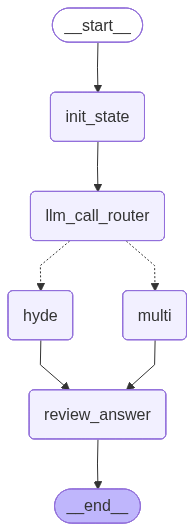
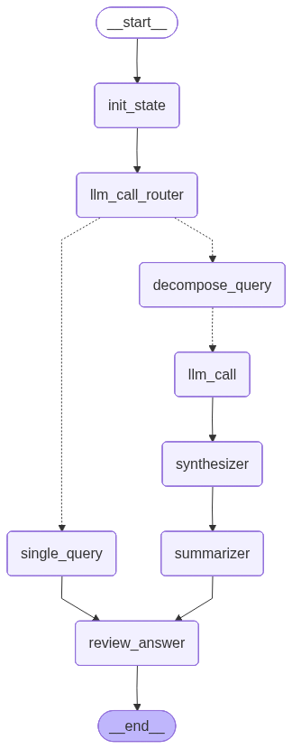
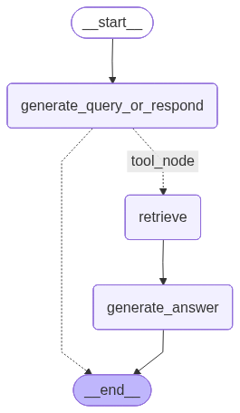

# Human in the Loop

## 주요 기능
- **Agent**
- **Human in the Loop**:
1. Approve or Reject
2. Approve or Edit or Reject
3. Validate Human input

## 워크플로우
**Rag HyDE / Multi Step  Feedback**

**Rag Single / Decomosed Query Feedback**

**Rag Filter Feedback**

## Rational
- Rag HyDE / Multi Step Feedback
  - approve
  - edit: 쿼리 변경
  - reject: Node 변경(Hyde or Multi step)
- Rag Single / Decomposed Query Feedback
  - approve
  - edit: 쿼리 변경
  - reject: step 변경(single or decomposed queries)
- Rag Filter Feedback: PGVector의 filter 기능을 도구로 사용. 
  - approve
  - edit: 검색 쿼리, 필터를 변경
  - reject
  - 정해진 필터(SPRI_2022,SPRI_2023 등)외엔 사용할 수 없음.
  