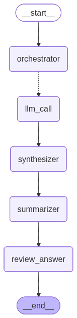

# Human in the Loop

## 주요 기능
- **Agent**
- **Human in the Loop**:
1. Approve or Reject
2. Approve or Edit or Reject
3. Validate Human input

## 워크플로우
**Rag Filter Feedback**

**Rag Decomposer Feedback**

## Rational
- Agent나 LLM의 응답에 사람이 검토할 수 있게 하여 답변의 품질을 높이기 위함.
- Rag Decomposer Feedback: 결과를 사람이 검토할 수 있는 로직 추가.
- Rag Filter Feedback: PGVector의 filter 기능을 도구로 사용. 
  - 도구 호출 시 사람이 검토
  - approve / edit / reject 응답을 할 수 있음
  - edit 시 검색쿼리, 필터를 변경할 수 있음
  - approve / edit / reject 외에 응답은 할 수 없음
  - 정해진 필터(SPRI_2022,SPRI_2023 등)외엔 사용할 수 없음.
  - 유효하지 않은 응답을 할 시 다시 프롬프트를 통해 응답.