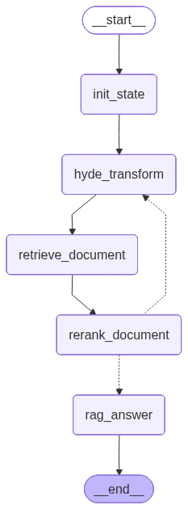
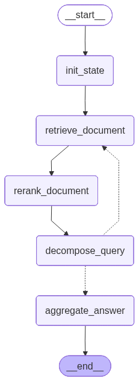
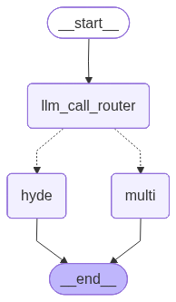

# RAG Hyde or Multi Step Query

## 주요 기능

- **에이전트**: LLM 에이전트가 HyDE / Multi 결정
- **HyDE**: 질문을 문장으로 LLM이 다시 생성하여 검색하는 방식
- **Multi Step Query**: 질문 -> 검색된 문서 -> 질문 생성 -> 검색된 문서 과정을 반복하여 검색하는 방식
- **하이브리드 검색**: BM25(키워드 기반) + FAISS(의미 기반) 

## 워크플로우
- **HyDE**

- **Multi Step Query**

- **Hyde or Multi Step Query Agent**

- HyDE, Multi Step Query 그래프를 구현하고 서브 노드로 사용

## Rational
- HyDE 방식은 상세한 질문이 주어질 때 효과적임. 범위가 넓거나 모호한 질문등에서는 환각을 일으키기 쉬움
- Multi Step Query 방식은 범위가 넓은 질문 모호한 질문에 효과적임. 상세한 질문인 경우 답변 범위가 좁혀지는 단점이 있음
- 두 방식은 서로 상쇄관계가 있어 질문에 따라 에이전트가 선택을 해주면 효과적인 답변을 해줄 수 있음 