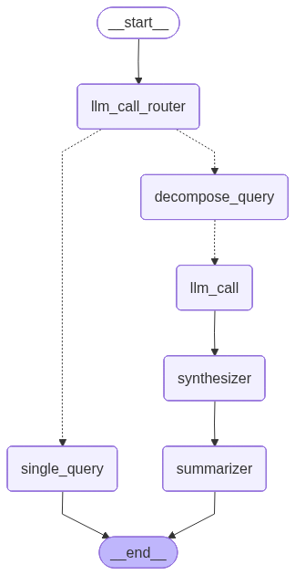

# RAG Single or Decompose

## 주요 기능

- **에이전트**: LLM 에이전트가 Single Query / Decompose Query 결정
- **Single Query**: 질문이 단순하다면 하나의 쿼리로 처리
- **Decompose Query**: 질문이 복잡하다면 여러 쿼리로 나누어 처리
- **하이브리드 검색**: BM25(키워드 기반) + FAISS(의미 기반) 

## 워크플로우

## 노드
- llm_call_router: Single / Decompose 쿼리 결정
- assign_workers: Decompse 할 경우 동적으로 LLM 인스턴스 생성하여 병렬적으로 처리
- summarizer: LLM 인스턴스에서 받은 응답들을 요약

## Rational
- 복잡한 질문일 때 답변 결과가 단순하게 나오거나 원하는 답변이 나오지 않는 경우가 있음
- 간단한 질문과 복잡한 질문 유형으로 나누어 처리하는 것이 효과적이라고 생각
- 복잡한 질문을 나눌 때 질문의 개수는 상황에 따라 다름. -> 동적으로 나눠진 쿼리를 처리